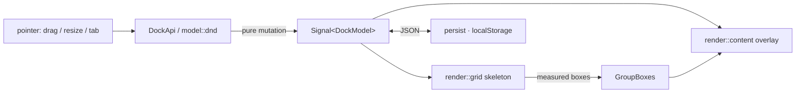

# Architecture

A dockview-style tiling/docking layout for Dioxus: panes split, resize, tab
together, float, and maximize, with the layout saved/restored as JSON. A faithful
port of `dockview-core` (vendored under `docs/refs/`), re-shaped for Dioxus.

## The one idea

dockview fuses a DOM element into every class and mutates it imperatively. We split
that in two:

- **Model** — one pure, serializable `DockModel` in a single `Signal`. The only
  source of truth. No DOM, no Dioxus; unit-testable and `cargo check`s on any target.
- **Render** — declarative `rsx!` derived from the model, in two stacked layers:
  1. *skeleton*: the split-tree as nested CSS-flex frames + tab strips + splitters.
     Holds **no** user content, so restructuring it freely is harmless.
  2. *content overlay*: one absolutely-positioned wrapper **per panel**, in a stable
     id-keyed list, positioned over its group's measured box. This is dockview's
     `OverlayRenderContainer` — and the reason a panel keeps its component instance
     (and inner JS state, e.g. a live map) while being dragged across the grid.

## Codemap

`model/` is the port of dockview's engine, as pure data + functions:
- `gridview` — the `GridNode` tree (`Leaf(Group)` | `Branch{orientation, children}`),
  location paths, `insert_split`/`remove_leaf`/`normalize`. (← `gridview/`)
- `splitview` — proportional resize math only; CSS does pixel layout. (← `splitview/`)
- `group` — a leaf's tab-group: `tabs` + `active`. (← `dockview/dockviewGroupPanel*`)
- `dnd` — `DragState` + `apply_drop`: the rule that an edge drop splits and a center
  drop tabs (dockview's `createDragToUpdates`). The **only** writer of reshaping. (← `dnd/`)
- `serial` — versioned JSON; `DockModel` *is* the serialized value. (← `gridview.ts`/`deserializer.ts`)

`render/` is everything DOM (Dioxus):
- `grid` — skeleton + `Splitter`; `group` — `GroupFrame`/`TabStrip` (+ measured slot);
  `content` — the flat overlay; `floating`, `drop_overlay` — overlays.

Edges: `api::DockApi` (scriptable handle over the `Signal`), `panel::DockPanel`
(consumer's content-by-id seam, ← framework adapters), `persist` (wasm-only storage),
`geometry`/`math` (orientation, 5-zone quadrant, rects).

## Invariants

- The model is the sole source of truth; every interaction is a pure mutation of it.
- The skeleton never holds user content; content lives **only** in the overlay layer.
- The content overlay's render order is **independent of layout** — never reorder it,
  or instances remount and stateful panels (maps, scroll, focus) reset.
- `floating` and `maximized` are overlay state **beside** the tree, never tree nodes.
- A branch's children carry percentages summing to 100; nested branches alternate
  orientation. `normalize` re-establishes both after every mutation.
- Pixel layout is the browser's job (flexbox + `min-*`); the model is unit-free
  percentages. The overlay's measured boxes are the one re-entry of pixels.

## What Dioxus replaces (absent on purpose)

dockview's `events.ts` Emitter → Signals; `lifecycle.ts` Disposable → component
scopes / `use_drop`; `dom.ts` element-building → `rsx!`. Popout windows
(`popoutWindowService`) are out of scope until multi-window is a hard requirement.

## References

- `docs/refs/dockview-core` is the canonical port source; `dockview-react`/`-vue`
  show the content-injection seam.
- insilicoterminal (the visual target) is a *custom* Vue split-tree, not a library;
  its saved page is only a Vite shell, so nothing is reused from it — only the model
  is confirmed (a recursive split-tree with per-pane tab strips), which is this design.
